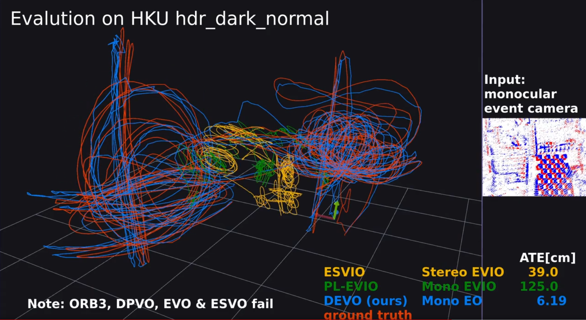

<h1 align="center">Deep Event Visual Odometry</h1>
<p align="center">
    <a href="https://vision.in.tum.de/members/klenk">Simon Klenk</a><sup>1,2*</sup> &emsp;&emsp;
    <a href="https://motzet.github.io">Marvin Motzet</a><sup>1,2*</sup> &emsp;&emsp;
    <a href="https://lukaskoestler.com">Lukas Koestler</a><sup>1,2</sup> &emsp;&emsp;
    <a href="https://vision.in.tum.de/members/cremers">Daniel Cremers</a><sup>1,2</sup>
</p>

<p align="center">
    <sup>*</sup>equal contribution
</p>

<p align="center">
    <sup>1</sup>Technical University of Munich (TUM) &emsp;&emsp;
    <sup>2</sup>Munich Center for Machine Learning (MCML)
</p>

<p align="center">
    International Conference on 3D Vision (3DV) 2024, Davos, CH
</p>


<p align="center">
    <a href="https://www.youtube.com/watch?v=rP_OuOE-O34">
        
    </a>
   <br>
</p>


<p align="center">
    <a href="https://arxiv.org/abs/2312.09800"><strong>Paper (arXiv)</strong></a> |
    <a href="https://www.youtube.com/watch?v=rP_OuOE-O34"><strong>Video</strong></a> |
    <a href="https://drive.google.com/file/d/1-u_rW03HvtYhjPT6pm1JBhTTPWxGdVWP/view?usp=sharing"><strong>Poster</strong></a> |
    <a href="#citation"><strong>BibTeX</strong></a>
</p>


## Abstract
Event cameras offer the exciting possibility of tracking the camera's pose during high-speed motion and in adverse lighting conditions. Despite this promise, existing event-based monocular visual odometry (VO) approaches demonstrate limited performance on recent benchmarks. To address this limitation, some methods resort to additional sensors such as IMUs, stereo event cameras, or frame-based cameras. Nonetheless, these additional sensors limit the application of event cameras in real-world devices since they increase cost and complicate system requirements. Moreover, relying on a frame-based camera makes the system susceptible to motion blur and HDR. To remove the dependency on additional sensors and to push the limits of using only a single event camera, we present **Deep Event VO (DEVO), the first monocular event-only system with strong performance on a large number of real-world benchmarks**. DEVO sparsely tracks selected event patches over time. A key component of DEVO is a novel deep patch selection mechanism tailored to event data. We significantly decrease the pose tracking error on seven real-world benchmarks by up to 97% compared to event-only methods and often surpass or are close to stereo or inertial methods.


## Overview
<p align="center">
  
</p>

During training, DEVO takes event voxel grids $`\{\mathbf{E}_t\}_{t=1}^N`$, inverse depths $`\{\mathbf{d}_t\}_{t=1}^N`$, and camera poses $`\{\mathbf{T}_t\}_{t=1}^N`$ of a sequence of size $N$ as input.
DEVO estimates poses $`\{\hat{\mathbf{T}}_t\}_{t=1}^N`$ and depths $`\{\hat{\mathbf{d}}_t\}_{t=1}^N`$ of the sequence.
Our novel patch selection network predicts a score map $\mathbf{S}_t$ to highlight optimal 2D coordinates $\mathbf{P}_t$ for optical flow and pose estimation.
A recurrent update operator iteratively refines the sparse patch-based optical flow $\hat{\mathbf{f}}$ between event grids by predicting $\Delta\hat{\mathbf{f}}$ and updates poses and depths through a differentiable bundle adjustment (DBA) layer, weighted by $\omega$, for each revision.
Ground truth optical flow $\mathbf{f}$ for supervision is computed using poses and depth maps. At inference, DEVO samples from a multinomial distribution based on the pooled score map $\mathbf{S}_t$.


## Setup
The code was tested on Ubuntu 22.04 and CUDA Toolkit 11.x. We use Anaconda to manage our Python environment.

First, clone the repo
```bash
git clone https://github.com/tum-vision/DEVO.git --recursive
cd DEVO
```
Then, create and activate the Anaconda environment
```bash
conda env create -f environment.yml
conda activate devo
```

Next, install the DEVO package
```bash
# download and unzip Eigen source code
wget https://gitlab.com/libeigen/eigen/-/archive/3.4.0/eigen-3.4.0.zip
unzip eigen-3.4.0.zip -d thirdparty

# install DEVO
pip install .
```

### Only for Training
*The following steps are only needed if you intend to (re)train DEVO. Please note, the training data have the size of about 1.1TB (rbg: 300GB, evs: 370GB).*

*Otherwise, skip it and go to [here](#only-for-evalution).*

First, download all RGB images and depth maps of [TartanAir](https://theairlab.org/tartanair-dataset/) from the left camera (~500GB) to `<TARTANPATH>`
```bash
python thirdparty/tartanair_tools/download_training.py --output-dir <TARTANPATH> --rgb --depth --only-left
```

Next, generate event voxel grids using [vid2e](https://github.com/uzh-rpg/rpg_vid2e).
```bash
python scripts/convert_tartan.py --dirsfile <path to .txt file>
```
`dirsfile` expects a .txt file containing line-separated paths to dirs with .png images (to generate events for these images).


### Only for Evalution
We provide a pretrained model for our simulated event data.

```bash
# download model (~40MB)
./download_model.sh
```

#### Data Preprocessing
We evaluate DEVO on seven real-world event-based datasets ([FPV](https://fpv.ifi.uzh.ch/), [VECtor](https://star-datasets.github.io/vector/), [HKU](https://github.com/arclab-hku/Event_based_VO-VIO-SLAM?tab=readme-ov-file#data-sequence), [EDS](https://rpg.ifi.uzh.ch/eds.html), [RPG](https://rpg.ifi.uzh.ch/ECCV18_stereo_davis.html), [MVSEC](https://daniilidis-group.github.io/mvsec/), [TUM-VIE](https://cvg.cit.tum.de/data/datasets/visual-inertial-event-dataset)). We provide scripts for data preprocessing (undist, ...).

Check `scripts/pp_DATASETNAME.py` for the way to preprocess the original datasets. This will create the necessary files for you, e.g. `rectify_map.h5`, `calib_undist.json` and `t_offset_us.txt`.  


## Training
Make sure you have run the [following steps](#only-for-training). Your dataset directory structure should look as follows

```
├── <TARTANPATH>
    ├── abandonedfactory
    ├── abandonedfactory_night
    ├── ...
    ├── westerndesert
```

To train DEVO with the default configuration, run
```bash
python train.py -c="config/DEVO_base.conf" --name=<your name>
```

The log files will be written to `runs/<your name>`. Please, check [`train.py`](train.py) for more options.

## Evaluation
Make sure you have run the [following steps](#only-for-evalution) (downloading pretrained model, data and preprocessing data).

```bash
python evals/eval_evs/eval_DATASETNAME_evs.py --datapath=<DATASETPATH> --weights="DEVO.pth" --stride=1 --trials=1 --expname=<your name>
```

The qualitative and quantitative results will be written to `results/DATASETNAME/<your name>`. Check [`eval_rpg_evs.py`](evals/eval_evs/eval_rpg_evs.py) for more options.

## News
- [x] Code and model are released.
- [x] Code for simulation is released.


## Citation
If you find our work useful, please cite our paper:

```bib
@inproceedings{klenk2023devo,
  title     = {Deep Event Visual Odometry},
  author    = {Klenk, Simon and Motzet, Marvin and Koestler, Lukas and Cremers, Daniel},
  booktitle = {International Conference on 3D Vision, 3DV 2024, Davos, Switzerland,
               March 18-21, 2024},
  pages     = {739--749},
  publisher = {{IEEE}},
  year      = {2024},
}
```


## Acknowledgments
We thank the authors of the following repositories for publicly releasing their work:

- [DPVO](https://github.com/princeton-vl/DPVO)
- [TartanAir](https://github.com/castacks/tartanair_tools)
- [vid2e](https://github.com/uzh-rpg/rpg_vid2e)
- [E2Calib](https://github.com/uzh-rpg/e2calib)
- [rpg_trajectory_evaluation](https://github.com/uzh-rpg/rpg_trajectory_evaluation)
- [Event-based Vision for VO/VIO/SLAM in Robotics](https://github.com/arclab-hku/Event_based_VO-VIO-SLAM)

This work was supported by the ERC Advanced Grant [SIMULACRON](https://cordis.europa.eu/project/id/884679).

