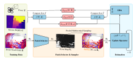

<h1 align="center">Deep Event Visual Odometry</h1>
<p align="center">
    <a href="https://vision.in.tum.de/members/klenk">Simon Klenk</a><sup>1,2*</sup> &emsp;&emsp;
    <a href="https://motzet.github.io">Marvin Motzet</a><sup>1,2*</sup> &emsp;&emsp;
    <a href="https://lukaskoestler.com">Lukas Koestler</a><sup>1,2</sup> &emsp;&emsp;
    <a href="https://vision.in.tum.de/members/cremers">Daniel Cremers</a><sup>1,2</sup>
</p>

<p align="center">
    <sup>*</sup>equal contribution
</p>

<p align="center">
    <sup>1</sup>Technical University of Munich (TUM) &emsp;&emsp;
    <sup>2</sup>Munich Center for Machine Learning (MCML)
</p>

<p align="center">
    International Conference on 3D Vision (3DV) 2024, Davos, CH
</p>

<p align="center">
    <a href="https://arxiv.org/pdf/2312.09800.pdf"><strong>Paper</strong></a> |
    <a href="https://arxiv.org/abs/2312.09800"><strong>arXiv</strong></a> |
    <a href="#citation"><strong>BibTeX</strong></a>
</p>


## Abstract
Event cameras offer the exciting possibility of tracking the camera's pose during high-speed motion and in adverse lighting conditions. Despite this promise, existing event-based monocular visual odometry (VO) approaches demonstrate limited performance on recent benchmarks. To address this limitation, some methods resort to additional sensors such as IMUs, stereo event cameras, or frame-based cameras. Nonetheless, these additional sensors limit the application of event cameras in real-world devices since they increase cost and complicate system requirements. Moreover, relying on a frame-based camera makes the system susceptible to motion blur and HDR. To remove the dependency on additional sensors and to push the limits of using only a single event camera, we present Deep Event VO (DEVO), the first monocular event-only system with strong performance on a large number of real-world benchmarks. DEVO sparsely tracks selected event patches over time. A key component of DEVO is a novel deep patch selection mechanism tailored to event data. We significantly decrease the pose tracking error on seven real-world benchmarks by up to 97% compared to event-only methods and often surpass or are close to stereo or inertial methods.


## Overview
<p align="center">
  
</p>

During training, DEVO takes event voxel grids $`\{\mathbf{E}_t\}_{t=1}^N`$, inverse depths $`\{\mathbf{d}_t\}_{t=1}^N`$, and camera poses $`\{\mathbf{T}_t\}_{t=1}^N`$ of a sequence of size $N$ as input.
DEVO estimates poses $`\{\hat{\mathbf{T}}_t\}_{t=1}^N`$ and depths $`\{\hat{\mathbf{d}}_t\}_{t=1}^N`$ of the sequence.
Our novel patch selection network predicts a score map $\mathbf{S}_t$ to highlight optimal 2D coordinates $\mathbf{P}_t$ for optical flow and pose estimation.
A recurrent update operator iteratively refines the sparse patch-based optical flow $\hat{\mathbf{f}}$ between event grids by predicting $\Delta\hat{\mathbf{f}}$ and updates poses and depths through a differentiable bundle adjustment (DBA) layer, weighted by $\omega$, for each revision.
Ground truth optical flow $\mathbf{f}$ for supervision is computed using poses and depth maps. At inference, DEVO samples from a multinomial distribution based on the pooled score map $\mathbf{S}_t$.


## Setup


## Training


## Evaluation


## Changelog
- [ ] 📣 Code and model will be released soon.


## Citation
If you find our work useful, please consider citing our paper:

```bib
@article{klenk2023devo,
  title     = {Deep Event Visual Odometry},
  author    = {Klenk, Simon and Motzet, Marvin and Koestler, Lukas and Cremers, Daniel},
  journal   = {arXiv preprint arXiv:2312.09800},
  year      = {2023}
}
```


## Acknowledgments
We thank the authors of the following repositories for publicly releasing their code:

- [DPVO](https://github.com/princeton-vl/DPVO)
- [vid2e](https://github.com/uzh-rpg/rpg_vid2e)
- [E2Calib](https://github.com/uzh-rpg/e2calib)
- [rpg_trajectory_evaluation](https://github.com/uzh-rpg/rpg_trajectory_evaluation)
- [Event-based Vision for VO/VIO/SLAM in Robotics](https://github.com/arclab-hku/Event_based_VO-VIO-SLAM)

This work was supported by the ERC Advanced Grant [SIMULACRON](https://cordis.europa.eu/project/id/884679).

